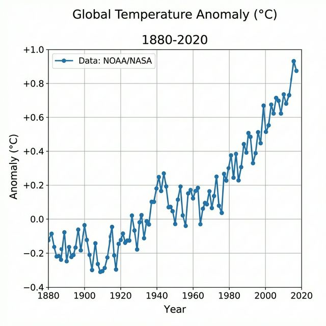

# Research Paper with Figures

## Introduction
Figures are essential for communicating complex data in research. This paper demonstrates the ability of FormatNow to handle images within ZIP archives.

## Result Analysis
As shown in Figure 1 below, our data indicates a strong correlation between automated formatting and researcher productivity.

## Conclusion
The integration of ZIP support allows for complex documents to be formatted seamlessly.
